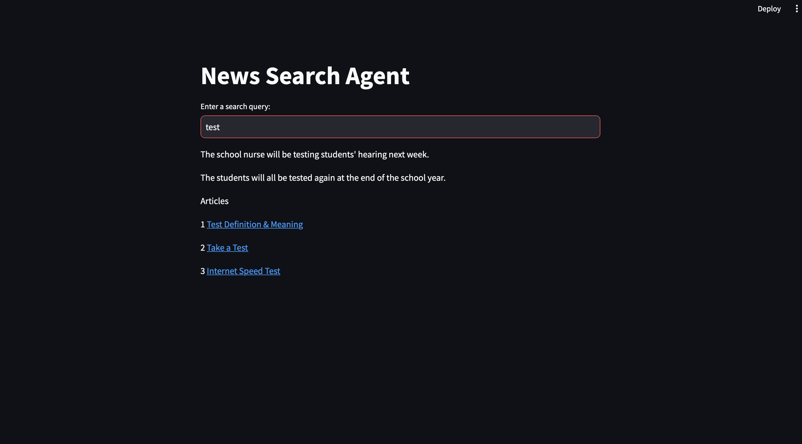

# SearchWithLLM
this is a streamlit app which uses google's free programmable search along with huggingface api to search internet and LLM helps to answer your query with that knowledge.

# Requirements 
Before you start this project you need to have 3 API Key
1. GOOGLE_CSE_ID you can find this at programmable search 
2. GOOGLE_API_KEY you can get this from google cloud
3. HUGGINGFACEHUB_API_TOKEN you can get this from huggingface profile

create a .env file with the above Keys and start the app.

# Package Dependencies
+ streamlit
+ newspaper3k
+ langchain
+ langchain_community

# Output 

